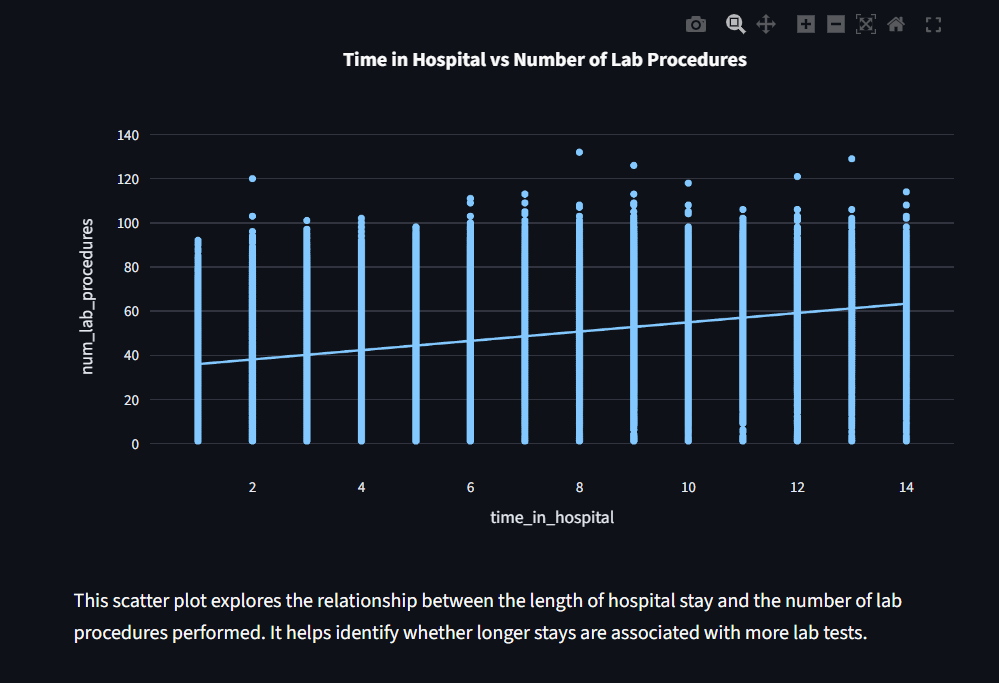

# Hospital Readmission Analysis

## Project Overview
Hospital readmissions within 30 days after discharge are a major challenge for modern healthcare. They increase hospital costs and can lead to penalties under programs like the Hospital Readmission Reduction Program (HRRP).  

This project uses a **data-driven approach** to identify patients at higher risk of readmission and supports proactive decision-making. Using patient history data, we analyze key factors that contribute to readmission within 30 days and provide actionable insights for hospital care.

## Live Demo
You can view the live dashboard here:  
[🔗 Streamlit App](https://prefixers-analyzing-diabetic-patient-readmissions.streamlit.app/)

## Project Documentation
Full project report can be found here:  
[📄 Project PDF](https://docs.google.com/document/d/1_U-n1J3SObllVegva8FrL1oYgilpKQLe2YXJWiaUsXE/edit?usp=sharing)

## Project Screenshots

### 1. Dashboard Home

### 2. Age Distribution of Patients

### 3. Readmission Rate by Medication Type

### 4. 30-Day Readmission Rate by VCI Risk Group

## Objective
- Analyze hospital patient data to understand patterns behind 30-day readmissions.  
- Identify high-risk patients using clinical and operational features.  
- Use the **Vitality Complexity Index (VCI)** and other patient metrics to support data-driven decisions.  

## Tools & Technologies
- Python 3  
- Pandas & NumPy for data cleaning and processing  
- Plotly Express for interactive visualizations  
- Streamlit for building the dashboard  

## Data Description
The dataset contains patient-level data including:
- Demographics (age, gender, race)  
- Admission details (emergency or planned, length of stay)  
- Clinical and complexity data (number of diagnoses, lab procedures, VCI score)  
- Medication and treatment data (medication type, changes, insulin/oral)  
- Discharge disposition  

## Project Workflow
1. **Data Collection and Cleaning**  
   - Combined multiple CSVs into one main dataframe  
   - Standardized nulls, updated column types, created meaningful columns  

2. **Exploratory Data Analysis**  
   - Examined demographic, clinical, operational, and medication features  
   - Created charts and visualizations for better insights  

3. **Feature Engineering**  
   - Created `readmit_30` for 30-day readmission  
   - Calculated scores like `L_score`, `A_score`, `C_score`, `E_score`  
   - Combined scores to create the **VCI Score** and risk categories  

4. **Insights & Key Findings**  
   - Readmissions are low but critical  
   - Gender and race have minimal effect on readmission (<3%)  
   - Medication changes during hospitalization increase readmission risk (~12%)  
   - Emergency admissions are linked to higher early readmission  
   - High VCI patients are the strongest predictors of readmission  

5. **Recommendations**  
   - Focus attention on high-risk patients (high VCI scores)  
   - Adjust nurse staffing based on patient complexity  
   - Provide extra care for patients discharged to nursing homes  
   - Use data-driven decisions to reduce readmissions and hospital costs  

## Dashboard Visualizations
The Streamlit dashboard includes:
- Age distribution of patients  
- Readmission status distribution  
- Readmission rates by race, gender, medication type, and medication changes  
- Scatter plot of hospital stay vs lab procedures  
- Correlation heatmap of numerical features  
- Box plots of stay time by readmission status  
- 30-day readmission rate by discharge disposition  
- Readmission rates by VCI Risk Group  